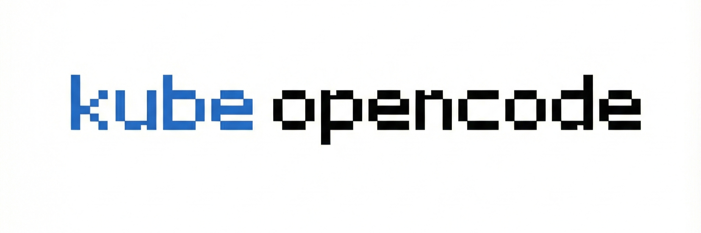

<p align="center">
  
</p>

<p align="center">
  <em>A Kubernetes-native system for executing AI-powered tasks</em>
</p>

> **Note**: This project uses [OpenCode](https://opencode.ai) as its AI coding agent. KubeOpenCode is not built by or affiliated with the OpenCode team.

<p align="center">
  <a href="https://opensource.org/licenses/Apache-2.0"></a>
  <a href="https://goreportcard.com/report/github.com/kubeopencode/kubeopencode"></a>
</p>

## Overview

KubeOpenCode enables you to execute AI agent tasks using Kubernetes Custom Resources. It provides a simple, declarative, GitOps-friendly approach to running AI agents as Kubernetes Pods.

**Key Features:**

- **Kubernetes-Native**: Built on CRDs and the Operator pattern
- **Simple API**: Task (WHAT to do) + Agent (HOW to execute)
- **AI-Agnostic**: Works with any AI agent (OpenCode, Claude, etc.)
- **No External Dependencies**: Uses etcd for state, Pods for execution
- **GitOps Ready**: Fully declarative resource definitions
- **Flexible Context System**: Support for Text, ConfigMaps, Git, Runtime, and URLs
- **Cross-Namespace Separation**: Platform teams manage Agents with credentials; dev teams create Tasks
- **Task Outputs**: Capture results from task execution into status
- **TaskTemplate**: Reusable templates for Task configurations (like Argo WorkflowTemplate)
- **Concurrency Control**: Limit concurrent tasks per Agent
- **Event-Driven**: Integrates with Argo Events for webhook-triggered Tasks
- **Batch Operations**: Use Helm/Kustomize for multiple Tasks (Kubernetes-native approach)

## Architecture

```
┌─────────────────────────────────────────────┐
│         Kubernetes API Server               │
│  - Custom Resource Definitions (CRDs)       │
│  - RBAC & Authentication                    │
└─────────────────┬───────────────────────────┘
                  │
                  ▼
┌─────────────────────────────────────────────┐
│      KubeOpenCode Controller (Operator)     │
│  - Watch Task CRs                           │
│  - Create Kubernetes Pods for tasks         │
│  - Update CR status                         │
└─────────────────┬───────────────────────────┘
                  │
                  ▼
┌─────────────────────────────────────────────┐
│            Kubernetes Pods                  │
│  - Execute tasks using AI agents            │
│  - Context files mounted as volumes         │
└─────────────────────────────────────────────┘
```

### Core Concepts

- **Task**: Single task execution (the primary API)
- **TaskTemplate**: Reusable template for Task creation (similar to Argo WorkflowTemplate)
- **Agent**: AI agent configuration (HOW to execute)
- **KubeOpenCodeConfig**: System-level configuration (optional)

> **Note**: Workflow orchestration and webhook triggers have been delegated to Argo Workflows and Argo Events respectively. KubeOpenCode focuses on the core Task/Agent abstraction.

## Quick Start

### Prerequisites

- Kubernetes 1.25+
- Helm 3.8+

### Installation

```bash
# Create namespace
kubectl create namespace kubeopencode-system

# Install from OCI registry
helm install kubeopencode oci://quay.io/kubeopencode/helm-charts/kubeopencode \
  --namespace kubeopencode-system

# Or install from local chart (for development)
helm install kubeopencode ./charts/kubeopencode \
  --namespace kubeopencode-system
```

### Example Usage

#### 1. Create an Agent

KubeOpenCode uses a **two-container pattern**:
- **Init Container** (`agentImage`): Copies OpenCode binary to `/tools` shared volume
- **Worker Container** (`executorImage`): Runs tasks using `/tools/opencode`

```yaml
apiVersion: kubeopencode.io/v1alpha1
kind: Agent
metadata:
  name: default
  namespace: kubeopencode-system
spec:
  agentImage: quay.io/kubeopencode/kubeopencode-agent-opencode:latest
  executorImage: quay.io/kubeopencode/kubeopencode-agent-devbox:latest
  workspaceDir: /workspace
  # command is optional - uses default if not specified:
  # ["sh", "-c", "/tools/opencode run \"$(cat ${WORKSPACE_DIR}/task.md)\""]
  command:
    - sh
    - -c
    - /tools/opencode run "$(cat ${WORKSPACE_DIR}/task.md)"
  serviceAccountName: kubeopencode-agent
  credentials:
    - name: opencode-api-key
      secretRef:
        name: ai-credentials
        key: opencode-key
      env: OPENCODE_API_KEY
```

#### 2. Create a Task

```yaml
apiVersion: kubeopencode.io/v1alpha1
kind: Task
metadata:
  name: update-service-a
  namespace: kubeopencode-system
spec:
  # Task description (becomes /workspace/task.md)
  description: |
    Update dependencies to latest versions.
    Run tests and create PR.

  # Optional inline contexts
  contexts:
    - type: Text
      text: |
        # Coding Standards
        - Use descriptive names
        - Write unit tests
```

#### 3. Monitor Progress

```bash
# Watch Task status
kubectl get tasks -n kubeopencode-system -w

# Check detailed status
kubectl describe task update-service-a -n kubeopencode-system

# View task logs
kubectl logs $(kubectl get task update-service-a -o jsonpath='{.status.podName}') -n kubeopencode-system
```

#### 4. Use TaskTemplate for Reusable Configurations

TaskTemplates let you define common Task configurations that can be shared across multiple Tasks:

```yaml
# Create a TaskTemplate with shared configuration
apiVersion: kubeopencode.io/v1alpha1
kind: TaskTemplate
metadata:
  name: pr-task-template
  namespace: kubeopencode-system
spec:
  agentRef:
    name: default
  contexts:
    - type: ConfigMap
      configMap:
        name: coding-standards
  outputs:
    parameters:
      - name: pr-url
        path: .outputs/pr-url
---
# Create Tasks that reference the template
apiVersion: kubeopencode.io/v1alpha1
kind: Task
metadata:
  name: fix-issue-123
spec:
  taskTemplateRef:
    name: pr-task-template
  description: |
    Fix issue #123: Login button not working on mobile.
```

**Merge Strategy:**

| Field | Merge Behavior |
|-------|----------------|
| `agentRef` | Task takes precedence; if not specified, uses Template's |
| `description` | Task takes precedence; if not specified, uses Template's |
| `contexts` | Template contexts first, then Task contexts (both included) |
| `outputs` | Merged by parameter name; Task takes precedence for same-named params |

### Batch Operations with Helm

For running the same task across multiple targets, use Helm templating:

```yaml
# values.yaml
tasks:
  - name: update-service-a
    repo: service-a
  - name: update-service-b
    repo: service-b
  - name: update-service-c
    repo: service-c

# templates/tasks.yaml
{{- range .Values.tasks }}
---
apiVersion: kubeopencode.io/v1alpha1
kind: Task
metadata:
  name: {{ .name }}
spec:
  description: "Update dependencies for {{ .repo }}"
{{- end }}
```

```bash
# Generate and apply multiple tasks
helm template my-tasks ./chart | kubectl apply -f -
```

## Key Features

### Flexible Context System

Tasks and Agents use inline **ContextItem** to provide additional context:

**Context Types:**
- **Text**: Inline text content
- **ConfigMap**: Content from ConfigMap
- **Git**: Content from Git repository
- **Runtime**: KubeOpenCode platform awareness system prompt
- **URL**: Content fetched from remote HTTP/HTTPS URL

**Example:**
```yaml
contexts:
  - type: Text
    text: |
      # Rules for AI Agent
      Always use signed commits...
  - type: ConfigMap
    configMap:
      name: my-scripts
    mountPath: .scripts
    fileMode: 493  # 0755 in decimal
  - type: Git
    git:
      repository: https://github.com/org/repo.git
      ref: main
    mountPath: source-code
  - type: URL
    url:
      source: https://api.example.com/openapi.yaml
    mountPath: specs/openapi.yaml
```

- **Content Aggregation**: Contexts without `mountPath` are written to `.kubeopencode/context.md` with XML tags. OpenCode loads this via `OPENCODE_CONFIG_CONTENT`, preserving any existing `AGENTS.md` in the repository

### Agent Configuration

Agent centralizes execution environment configuration:

```yaml
apiVersion: kubeopencode.io/v1alpha1
kind: Agent
metadata:
  name: default
spec:
  agentImage: quay.io/kubeopencode/kubeopencode-agent-opencode:latest
  executorImage: quay.io/kubeopencode/kubeopencode-agent-devbox:latest
  workspaceDir: /workspace
  command:
    - sh
    - -c
    - /tools/opencode run "$(cat ${WORKSPACE_DIR}/task.md)"
  serviceAccountName: kubeopencode-agent

  # Default contexts for all tasks (inline ContextItems)
  contexts:
    - type: Text
      text: |
        # Organization Standards
        - Use signed commits
        - Follow Go conventions

  # Credentials (secrets as env vars or file mounts)
  credentials:
    - name: github-token
      secretRef:
        name: github-creds
        key: token
      env: GITHUB_TOKEN

    - name: ssh-key
      secretRef:
        name: ssh-keys
        key: id_rsa
      mountPath: /home/agent/.ssh/id_rsa
      fileMode: 0400
```

### OpenCode Configuration

The `config` field allows you to provide OpenCode configuration as an inline JSON string:

```yaml
apiVersion: kubeopencode.io/v1alpha1
kind: Agent
metadata:
  name: opencode-agent
spec:
  agentImage: quay.io/kubeopencode/kubeopencode-agent-opencode:latest
  executorImage: quay.io/kubeopencode/kubeopencode-agent-devbox:latest
  workspaceDir: /workspace
  serviceAccountName: kubeopencode-agent
  config: |
    {
      "$schema": "https://opencode.ai/config.json",
      "model": "google/gemini-2.5-pro",
      "small_model": "google/gemini-2.5-flash"
    }
```

The configuration is written to `/tools/opencode.json` and the `OPENCODE_CONFIG` environment variable is set automatically. See [OpenCode configuration schema](https://opencode.ai/config.json) for available options.

### Multi-AI Support

Use different Agents with different executorImages for various use cases:

```yaml
# Standard OpenCode agent with devbox
apiVersion: kubeopencode.io/v1alpha1
kind: Agent
metadata:
  name: opencode-devbox
spec:
  agentImage: quay.io/kubeopencode/kubeopencode-agent-opencode:latest
  executorImage: quay.io/kubeopencode/kubeopencode-agent-devbox:latest
  workspaceDir: /workspace
  command:
    - sh
    - -c
    - /tools/opencode run "$(cat ${WORKSPACE_DIR}/task.md)"
  serviceAccountName: kubeopencode-agent
---
# OpenCode agent with code-server (browser-based IDE)
apiVersion: kubeopencode.io/v1alpha1
kind: Agent
metadata:
  name: opencode-code-server
spec:
  agentImage: quay.io/kubeopencode/kubeopencode-agent-opencode:latest
  executorImage: quay.io/kubeopencode/kubeopencode-agent-code-server:latest
  workspaceDir: /workspace
  command:
    - sh
    - -c
    - /tools/opencode run "$(cat ${WORKSPACE_DIR}/task.md)"
  serviceAccountName: kubeopencode-agent
---
# Task using specific agent
apiVersion: kubeopencode.io/v1alpha1
kind: Task
metadata:
  name: task-with-opencode
spec:
  agentRef:
    name: opencode-devbox
  description: "Update dependencies and create a PR"
```

### Task Outputs

Capture results from task execution using output parameters:

```yaml
apiVersion: kubeopencode.io/v1alpha1
kind: Agent
metadata:
  name: pr-agent
spec:
  agentImage: quay.io/kubeopencode/kubeopencode-agent-opencode:latest
  executorImage: quay.io/kubeopencode/kubeopencode-agent-devbox:latest
  workspaceDir: /workspace
  command:
    - sh
    - -c
    - /tools/opencode run "$(cat ${WORKSPACE_DIR}/task.md)"
  serviceAccountName: kubeopencode-agent
  # Define output parameters to capture
  outputs:
    parameters:
      - name: pr-url
        path: ".outputs/pr-url"
      - name: summary
        path: ".outputs/summary"
        default: "No summary provided"
```

**Retrieving outputs:**
```bash
# Get specific output parameter
kubectl get task my-task -o jsonpath='{.status.outputs.parameters.pr-url}'

# Get all output parameters
kubectl get task my-task -o jsonpath='{.status.outputs.parameters}'
```

Tasks can define multiple output parameters:
```yaml
apiVersion: kubeopencode.io/v1alpha1
kind: Task
metadata:
  name: my-task
spec:
  agentRef:
    name: pr-agent
  description: "Create a PR for the feature"
  outputs:
    parameters:
      - name: pr-url
        path: ".outputs/pr-url"
      - name: custom-metric
        path: ".outputs/custom-metric"
```

### Task Stop

Stop a running task using the stop annotation:

```bash
kubectl annotate task my-task kubeopencode.io/stop=true
```

When this annotation is detected:
- The controller deletes the Pod (with graceful termination period)
- Task status is set to `Completed` with a `Stopped` condition
- The `Stopped` condition has reason `UserStopped`

**Note:** Logs are lost when a Task is stopped. For log persistence, use an external log aggregation system.

### Concurrency Control

Limit concurrent tasks per Agent when using rate-limited AI services:

```yaml
apiVersion: kubeopencode.io/v1alpha1
kind: Agent
metadata:
  name: rate-limited-agent
spec:
  agentImage: quay.io/kubeopencode/kubeopencode-agent-opencode:latest
  executorImage: quay.io/kubeopencode/kubeopencode-agent-devbox:latest
  workspaceDir: /workspace
  command:
    - sh
    - -c
    - /tools/opencode run "$(cat ${WORKSPACE_DIR}/task.md)"
  serviceAccountName: kubeopencode-agent
  maxConcurrentTasks: 3  # Only 3 Tasks can run at once
```

When the limit is reached:
- New Tasks enter `Queued` phase instead of `Running`
- Queued Tasks automatically transition to `Running` when capacity becomes available
- Tasks are processed in approximate FIFO order

### Quota (Rate Limiting)

In addition to `maxConcurrentTasks` (which limits simultaneous running Tasks), you can configure `quota` to limit the rate at which Tasks can start using a sliding time window:

```yaml
apiVersion: kubeopencode.io/v1alpha1
kind: Agent
metadata:
  name: rate-limited-agent
spec:
  agentImage: quay.io/kubeopencode/kubeopencode-agent-opencode:latest
  executorImage: quay.io/kubeopencode/kubeopencode-agent-devbox:latest
  workspaceDir: /workspace
  serviceAccountName: kubeopencode-agent
  quota:
    maxTaskStarts: 10     # Maximum 10 task starts
    windowSeconds: 3600   # Per hour (sliding window)
```

**Quota vs MaxConcurrentTasks:**

| Feature | `maxConcurrentTasks` | `quota` |
|---------|----------------------|---------|
| What it limits | Simultaneous running Tasks | Rate of new Task starts |
| Time component | No (instant check) | Yes (sliding window) |
| Queued Reason | `AgentAtCapacity` | `QuotaExceeded` |
| Use case | Limit resource usage | API rate limiting |

Both can be used together for comprehensive control. When quota is exceeded, new Tasks enter `Queued` phase with reason `QuotaExceeded`.

### Cross-Namespace Task/Agent Separation

Enable separation of concerns between platform and dev teams:

```
┌─────────────────────────────────────────────────────────────────┐
│                    Task Namespace (dev-team-a)                  │
│  ┌──────────┐                                                   │
│  │   Task   │  agentRef:                                        │
│  │          │    name: opencode-agent                           │
│  │          │    namespace: platform-agents                     │
│  └──────────┘                                                   │
└─────────────────────────────────────────────────────────────────┘
        │ references
        ▼
┌─────────────────────────────────────────────────────────────────┐
│                  Agent Namespace (platform-agents)              │
│  ┌──────────┐     ┌──────────┐     ┌──────────┐                │
│  │  Agent   │     │ Secrets  │     │   Pod    │◄── runs here   │
│  │          │     │(API keys)│     │          │                │
│  └──────────┘     └──────────┘     └──────────┘                │
└─────────────────────────────────────────────────────────────────┘
```

**Example:**

```yaml
# In platform-agents namespace - managed by Infra team
apiVersion: kubeopencode.io/v1alpha1
kind: Agent
metadata:
  name: opencode-agent
  namespace: platform-agents
spec:
  # Restrict which namespaces can use this Agent
  allowedNamespaces:
    - "dev-*"
    - "staging"
  agentImage: quay.io/kubeopencode/kubeopencode-agent-opencode:latest
  executorImage: quay.io/kubeopencode/kubeopencode-agent-devbox:latest
  serviceAccountName: kubeopencode-agent
  workspaceDir: /workspace
  command:
    - sh
    - -c
    - /tools/opencode run "$(cat ${WORKSPACE_DIR}/task.md)"
  credentials:
    - name: anthropic-key
      secretRef:
        name: anthropic-credentials
        key: api-key
      env: ANTHROPIC_API_KEY
---
# In dev-team-a namespace - created by Dev team
apiVersion: kubeopencode.io/v1alpha1
kind: Task
metadata:
  name: fix-bug-123
  namespace: dev-team-a
spec:
  agentRef:
    name: opencode-agent
    namespace: platform-agents
  description: "Fix the bug in authentication module"
```

**Result:**
- Task exists in `dev-team-a` namespace
- Pod runs in `platform-agents` namespace (where Agent lives)
- Credentials stay in `platform-agents` - never exposed to dev team
- Task status shows `podNamespace: platform-agents`

**AllowedNamespaces** supports glob patterns:
- `"dev-*"` - matches `dev-team-a`, `dev-team-b`, etc.
- `"staging"` - exact match
- Empty list (default) - all namespaces allowed

### Pod Configuration

Configure advanced Pod settings using `podSpec`:

```yaml
apiVersion: kubeopencode.io/v1alpha1
kind: Agent
metadata:
  name: advanced-agent
spec:
  agentImage: quay.io/kubeopencode/kubeopencode-agent-opencode:latest
  executorImage: quay.io/kubeopencode/kubeopencode-agent-devbox:latest
  workspaceDir: /workspace
  command:
    - sh
    - -c
    - /tools/opencode run "$(cat ${WORKSPACE_DIR}/task.md)"
  serviceAccountName: kubeopencode-agent
  podSpec:
    # Labels for NetworkPolicy, monitoring, etc.
    labels:
      network-policy: agent-restricted
    # Enhanced isolation with gVisor or Kata
    runtimeClassName: gvisor
    # Scheduling configuration
    scheduling:
      nodeSelector:
        node-type: ai-workload
      tolerations:
        - key: "dedicated"
          operator: "Equal"
          value: "ai-workload"
          effect: "NoSchedule"
```

## Agent Images

KubeOpenCode provides **template agent images** that serve as starting points for building your own customized agents. These templates demonstrate the agent interface pattern and include common development tools, but are designed to be customized based on your specific requirements.

KubeOpenCode uses a **two-container pattern**:

1. **Init Container** (`agentImage`): Contains the OpenCode CLI, copies it to a shared `/tools` volume
2. **Worker Container** (`executorImage`): Your development environment that uses `/tools/opencode`

### Available Images

| Image | Type | Description |
|-------|------|-------------|
| `opencode` | Init Container | OpenCode CLI binary |
| `devbox` | Worker (Executor) | Universal development environment with Go, Node, Python, kubectl, helm |
| `code-server` | Worker (Executor) | Browser-based VSCode IDE |
| `echo` | Testing | Minimal Alpine image for E2E testing |

### Image Resolution

When configuring an Agent, the controller resolves images as follows:

| Configuration | Init Container | Worker Container |
|--------------|----------------|------------------|
| Both `agentImage` and `executorImage` set | `agentImage` | `executorImage` |
| Only `agentImage` set (legacy) | Default OpenCode image | `agentImage` |
| Neither set | Default OpenCode image | Default devbox image |

**Default Images:**
- OpenCode init: `quay.io/kubeopencode/kubeopencode-agent-opencode:latest`
- Devbox executor: `quay.io/kubeopencode/kubeopencode-agent-devbox:latest`

### Building Agent Images

```bash
# Build OpenCode init container
make agent-build AGENT=opencode

# Build executor containers
make agent-build AGENT=devbox
make agent-build AGENT=code-server

# Customize registry and version
make agent-build AGENT=devbox IMG_REGISTRY=docker.io IMG_ORG=myorg VERSION=v1.0.0
```

For detailed guidance on building custom agent images, see the [Agent Developer Guide](agents/README.md).

## Development

See [Local Development Guide](docs/local-development.md) for detailed setup instructions including Kind cluster setup, image building, and iterative development.

### Quick Commands

```bash
make build      # Build the controller
make test       # Run tests
make lint       # Run linter
make run        # Run controller locally (requires kubeconfig)
```

For E2E testing, agent images, and Docker builds, see the [Local Development Guide](docs/local-development.md).

## Documentation

- [Architecture](docs/architecture.md) - Detailed architecture and design decisions
- [Local Development](docs/local-development.md) - Development environment setup
- [Troubleshooting](docs/troubleshooting.md) - Common issues and solutions
- [Helm Chart](charts/kubeopencode/README.md) - Deployment and configuration
- [Agent Development](agents/README.md) - Building custom agent images
- [ADRs](docs/adr/) - Architecture Decision Records

## Security

### RBAC

KubeOpenCode follows the principle of least privilege:

- **Controller**: ClusterRole with minimal permissions for Tasks, Agents, Pods, ConfigMaps, Secrets, and Events
- **Agent ServiceAccount**: Namespace-scoped Role with read/update access to Tasks and read-only access to related resources
- **Cross-Namespace Isolation**: When Tasks reference Agents in different namespaces, Pods run in the Agent's namespace, keeping credentials isolated

### Credential Management

- Secrets mounted with restrictive file permissions (default `0600`)
- Supports both environment variable and file-based credential mounting
- Git authentication via SecretRef (HTTPS or SSH)
- Cross-namespace Agent references keep credentials in the Agent's namespace

### Controller Pod Security

The controller runs with hardened security settings:

- `runAsNonRoot: true`
- `allowPrivilegeEscalation: false`
- All Linux capabilities dropped

### Agent Pod Security

Agent Pods rely on cluster-level security policies. For production deployments, consider:

- Configuring Pod Security Standards (PSS) at the namespace level
- Using `spec.podSpec.runtimeClassName` for gVisor or Kata Containers isolation
- Applying NetworkPolicies to restrict Agent Pod network access
- Setting resource limits via LimitRange or ResourceQuota

### Best Practices

- **Never commit secrets to Git** - use Kubernetes Secrets, External Secrets Operator, or HashiCorp Vault
- **Use AllowedNamespaces** on Agents to restrict which namespaces can create Tasks against them
- **Apply NetworkPolicies** to limit Agent Pod egress to required endpoints only
- **Enable Kubernetes audit logging** to track Task creation and execution

## Troubleshooting

See the [Troubleshooting Guide](docs/troubleshooting.md) for common issues and solutions.

Quick debugging commands:

```bash
# Check controller logs
kubectl logs -n kubeopencode-system deployment/kubeopencode-controller

# List task pods
kubectl get pods -l kubeopencode.io/task

# Check task status
kubectl describe task <task-name>
```

## Contributing

We welcome contributions! See [CONTRIBUTING.md](CONTRIBUTING.md) for guidelines on:

- Commit standards (signed commits required)
- Pull request process
- Code standards and testing requirements
- Development workflow

## Roadmap

- [x] Core Task/Agent abstraction
- [x] Inline ContextItem system (Text, ConfigMap, Git, Runtime, URL)
- [x] Argo Events integration for webhook-triggered Tasks
- [x] Task output capture system
- [x] Task stop feature (annotation-based)
- [x] Agent concurrency control (maxConcurrentTasks)
- [x] Pod configuration (labels, scheduling, runtimeClassName)
- [x] Cross-namespace Task/Agent separation (credential isolation)
- [ ] Web UI for monitoring and management
- [ ] Metrics (Prometheus) for Task/Agent observability

## Community

- **Issues**: [GitHub Issues](https://github.com/kubeopencode/kubeopencode/issues)
- **Discussions**: [GitHub Discussions](https://github.com/kubeopencode/kubeopencode/discussions)

## License

Copyright Contributors to the KubeOpenCode project.

Licensed under the Apache License, Version 2.0 (the "License"); you may not use this file except in compliance with the License. You may obtain a copy of the License at:

http://www.apache.org/licenses/LICENSE-2.0

Unless required by applicable law or agreed to in writing, software distributed under the License is distributed on an "AS IS" BASIS, WITHOUT WARRANTIES OR CONDITIONS OF ANY KIND, either express or implied. See the License for the specific language governing permissions and limitations under the License.

## Acknowledgments

KubeOpenCode is inspired by:
- Tekton Pipelines
- Argo Workflows
- Kubernetes Batch API

Built with:
- [controller-runtime](https://github.com/kubernetes-sigs/controller-runtime)
- [kubebuilder](https://github.com/kubernetes-sigs/kubebuilder)

---

Made with love by the KubeOpenCode community
